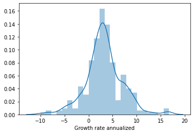
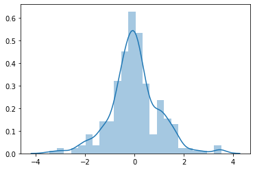
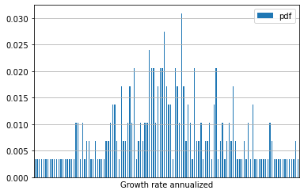
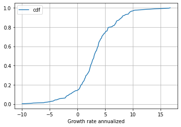
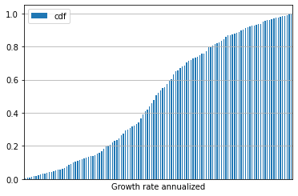

```python
import pandas as pd
import numpy as np
import matplotlib.pyplot as plt
import scipy.stats as stats
import seaborn as sns
import csv
import json
import requests
from scipy.stats import kurtosis, skew
```


```python
from fredapi import Fred
fred = Fred(api_key_file=(r'C:\Users\Nick\Downloads\assessment\api_key_file.txt'))
GDP = fred.get_series('A191RL1Q225SBEA')
GDP_df = GDP.reset_index()
GDP_df.columns = ['Date','Growth rate annualized']
GDP_df['Date'] = pd.to_datetime(GDP_df['Date'])
GDP = GDP_df[(GDP_df['Date'] < '2020-01-01')]
GDP.head()
```
<table border="1" class="dataframe">
  <thead>
    <tr style="text-align: right;">
      <th></th>
      <th>Date</th>
      <th>Growth rate annualized</th>
    </tr>
  </thead>
  <tbody>
    <tr>
      <th>0</th>
      <td>1947-04-01</td>
      <td>-1.0</td>
    </tr>
    <tr>
      <th>1</th>
      <td>1947-07-01</td>
      <td>-0.8</td>
    </tr>
    <tr>
      <th>2</th>
      <td>1947-10-01</td>
      <td>6.4</td>
    </tr>
    <tr>
      <th>3</th>
      <td>1948-01-01</td>
      <td>6.2</td>
    </tr>
    <tr>
      <th>4</th>
      <td>1948-04-01</td>
      <td>6.8</td>
    </tr>
  </tbody>
</table>
</div>


```python
mu = round(GDP['Growth rate annualized'].mean(), 4)
sigma = round(GDP['Growth rate annualized'].std(), 4)
n = GDP['Growth rate annualized'].count()
```


```python
GDP_z = pd.DataFrame(GDP['Growth rate annualized'] - mu)/(sigma)
GDP_z.reset_index()
GDP_z.columns = ['Growth rate z-score']
GDP_z['Date'] = GDP_df['Date']
z_scores = GDP_z['Growth rate z-score']
GDP_z = GDP_z[['Date','Growth rate z-score']]
GDP_z.head()
```
<table border="1" class="dataframe">
  <thead>
    <tr style="text-align: right;">
      <th></th>
      <th>Date</th>
      <th>Growth rate z-score</th>
    </tr>
  </thead>
  <tbody>
    <tr>
      <th>0</th>
      <td>1947-04-01</td>
      <td>-1.097551</td>
    </tr>
    <tr>
      <th>1</th>
      <td>1947-07-01</td>
      <td>-1.045385</td>
    </tr>
    <tr>
      <th>2</th>
      <td>1947-10-01</td>
      <td>0.832599</td>
    </tr>
    <tr>
      <th>3</th>
      <td>1948-01-01</td>
      <td>0.780432</td>
    </tr>
    <tr>
      <th>4</th>
      <td>1948-04-01</td>
      <td>0.936931</td>
    </tr>
  </tbody>
</table>
</div>


```python
Q1_1950 = GDP_z.loc[GDP_z['Date'] == '1950-01-01']
print(Q1_1950)
```

             Date  Growth rate z-score
    11 1950-01-01             3.519158
    


```python
mu
```


    3.2079


```python
sigma
```


    3.8339


```python
n
```


    291


```python
sns.distplot(GDP['Growth rate annualized'])
```


    





```python
# z value dist plotted
z_data = [(x - GDP['Growth rate annualized'].mean())/GDP['Growth rate annualized'].std() for x in GDP['Growth rate annualized']]
sns.distplot(z_data)
```


    





```python
# Frequency
stats_df = GDP.groupby('Growth rate annualized')['Growth rate annualized'].agg('count').pipe(pd.DataFrame)

stats_df.columns = ['frequency']
```


```python
# PDF
stats_df['pdf'] = (stats_df['frequency']) / (sum(stats_df['frequency']))
stats_df
```


<table border="1" class="dataframe">
  <thead>
    <tr style="text-align: right;">
      <th></th>
      <th>frequency</th>
      <th>pdf</th>
    </tr>
    <tr>
      <th>Growth rate annualized</th>
      <th></th>
      <th></th>
    </tr>
  </thead>
  <tbody>
    <tr>
      <th>-10.0</th>
      <td>1</td>
      <td>0.003436</td>
    </tr>
    <tr>
      <th>-8.4</th>
      <td>1</td>
      <td>0.003436</td>
    </tr>
    <tr>
      <th>-8.0</th>
      <td>1</td>
      <td>0.003436</td>
    </tr>
    <tr>
      <th>-6.1</th>
      <td>1</td>
      <td>0.003436</td>
    </tr>
    <tr>
      <th>-5.9</th>
      <td>1</td>
      <td>0.003436</td>
    </tr>
    <tr>
      <th>...</th>
      <td>...</td>
      <td>...</td>
    </tr>
    <tr>
      <th>11.9</th>
      <td>1</td>
      <td>0.003436</td>
    </tr>
    <tr>
      <th>12.8</th>
      <td>1</td>
      <td>0.003436</td>
    </tr>
    <tr>
      <th>13.8</th>
      <td>1</td>
      <td>0.003436</td>
    </tr>
    <tr>
      <th>16.4</th>
      <td>2</td>
      <td>0.006873</td>
    </tr>
    <tr>
      <th>16.7</th>
      <td>1</td>
      <td>0.003436</td>
    </tr>
  </tbody>
</table>
<p>123 rows × 2 columns</p>
</div>


```python
# CDF
stats_df['cdf'] = stats_df['pdf'].cumsum()
stats_df = stats_df.reset_index()
stats_df
```


<table border="1" class="dataframe">
  <thead>
    <tr style="text-align: right;">
      <th></th>
      <th>Growth rate annualized</th>
      <th>frequency</th>
      <th>pdf</th>
      <th>cdf</th>
    </tr>
  </thead>
  <tbody>
    <tr>
      <th>0</th>
      <td>-10.0</td>
      <td>1</td>
      <td>0.003436</td>
      <td>0.003436</td>
    </tr>
    <tr>
      <th>1</th>
      <td>-8.4</td>
      <td>1</td>
      <td>0.003436</td>
      <td>0.006873</td>
    </tr>
    <tr>
      <th>2</th>
      <td>-8.0</td>
      <td>1</td>
      <td>0.003436</td>
      <td>0.010309</td>
    </tr>
    <tr>
      <th>3</th>
      <td>-6.1</td>
      <td>1</td>
      <td>0.003436</td>
      <td>0.013746</td>
    </tr>
    <tr>
      <th>4</th>
      <td>-5.9</td>
      <td>1</td>
      <td>0.003436</td>
      <td>0.017182</td>
    </tr>
    <tr>
      <th>...</th>
      <td>...</td>
      <td>...</td>
      <td>...</td>
      <td>...</td>
    </tr>
    <tr>
      <th>118</th>
      <td>11.9</td>
      <td>1</td>
      <td>0.003436</td>
      <td>0.982818</td>
    </tr>
    <tr>
      <th>119</th>
      <td>12.8</td>
      <td>1</td>
      <td>0.003436</td>
      <td>0.986254</td>
    </tr>
    <tr>
      <th>120</th>
      <td>13.8</td>
      <td>1</td>
      <td>0.003436</td>
      <td>0.989691</td>
    </tr>
    <tr>
      <th>121</th>
      <td>16.4</td>
      <td>2</td>
      <td>0.006873</td>
      <td>0.996564</td>
    </tr>
    <tr>
      <th>122</th>
      <td>16.7</td>
      <td>1</td>
      <td>0.003436</td>
      <td>1.000000</td>
    </tr>
  </tbody>
</table>
<p>123 rows × 4 columns</p>
</div>


```python
pdf_plot = stats_df.plot.bar(x = 'Growth rate annualized', y = 'pdf', grid = True)
pdf_plot.set_xticks(ticks=[])
```


    





```python
stats_df.sort_values('Growth rate annualized').plot(x = 'Growth rate annualized', y = 'cdf', grid = True)
```


    





```python
cdf_bar = stats_df.plot.bar(x = 'Growth rate annualized', y = 'cdf', grid = True)
cdf_bar.set_xticks(ticks=[])
```


    





#### Level Up

Find the z-score of a 6.1% annual growth (China's 2019 GDP growth rate)


```python
z_score = (6.1 - mu) / (sigma)
print(round(z_score, 4))
```

    0.7543
    


```python
skew = stats.skew(GDP['Growth rate annualized'])
kurtosis = stats.kurtosis(GDP['Growth rate annualized'])
print("Skew is: " + str(round(skew, 4)))
print("Kurtosis is: " + str((round(kurtosis, 4))))
```

    Skew is: 0.1352
    Kurtosis is: 1.6133
    


```python
!jupyter nbconvert --to markdown assessment.ipynb && move assessment.md README.md
```

            1 file(s) moved.
    

    [NbConvertApp] Converting notebook assessment.ipynb to markdown
    [NbConvertApp] Support files will be in assessment_files\
    [NbConvertApp] Making directory assessment_files
    [NbConvertApp] Making directory assessment_files
    [NbConvertApp] Making directory assessment_files
    [NbConvertApp] Making directory assessment_files
    [NbConvertApp] Making directory assessment_files
    [NbConvertApp] Writing 8889 bytes to assessment.md
    
